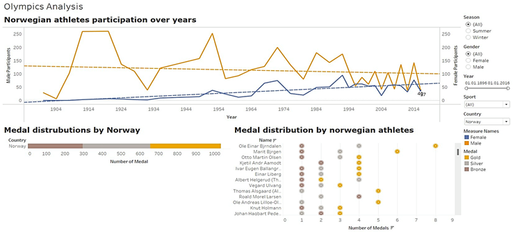
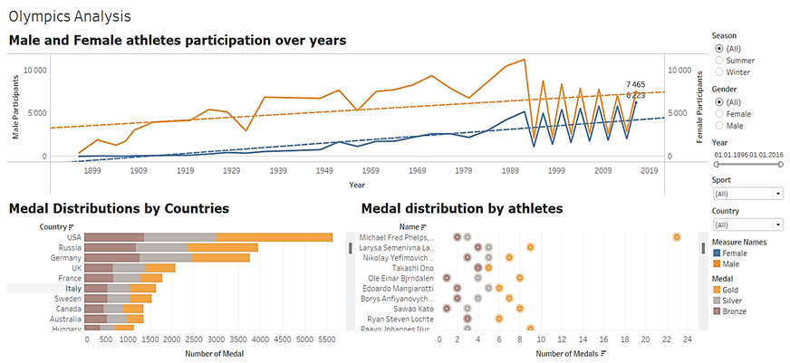
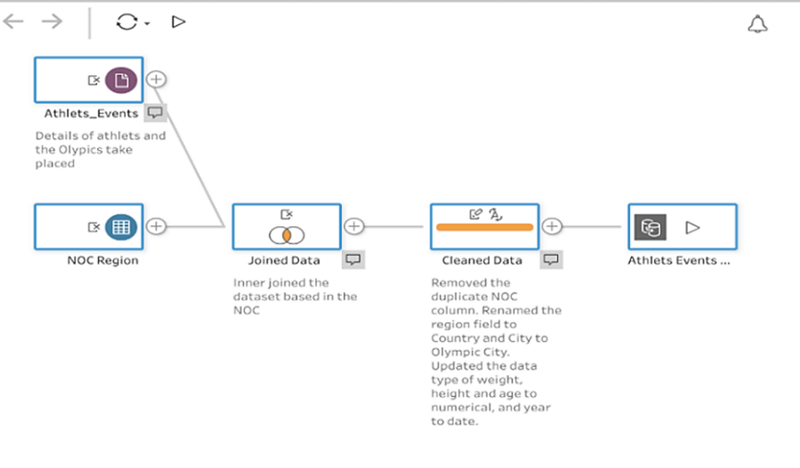

# Olympic Visual Analytics 2024

This project explores the performance and participation of Norwegian Olympic athletes using Tableau Desktop.  
It combines storytelling, interactivity, and clear design to reveal data-driven insights from 1896 – 2016.

---

## Table of Contents
- [Overview](#overview)
- [Explanatory Text](#explanatory-text)
- [Design Explanation](#design-explanation)
- [Dashboard Insights](#dashboard-insights)
- [Recommendations](#recommendations)
- [References](#references)
- [Files](#files)
- [Author](#author)

---

## Overview

The visualization includes participation trends, medal distributions, and top-athlete performance.  
Together, they illustrate how Norway’s Olympic presence evolved compared to other nations.

### Norwegian Athlete Participation and Medal Distribution
Above, the chart shows male and female athlete participation and medal counts.

### Global Medal and Participation Comparison
This visualization compares Norway’s achievements to other leading countries.

---

## Explanatory Text

Tableau was used to import, clean, and merge datasets for analysis.  
Unnecessary columns were removed and renamed for clarity. For example:  
- “City” → **Olympic City**  
- “Region” → **Country**  

Date fields were reformatted to *year-to-date*, and numerical data types were applied to *Age*, *Height*, and *Weight*.  
Geographic roles were assigned to *Country* and *Olympic City* to enable accurate mapping and visualization.

Below is a visual overview of the data cleaning and preparation workflow:

The combined dataset enabled an interactive dashboard that explores participation, medal distribution, and athlete performance across all Olympic Games between 1896 and 2016.  
It was designed for analysts, historians, coaches, athletes, policymakers, and the general public — anyone interested in understanding Norwegian sports achievements through a data-driven lens.

---

## Design Explanation

The design emphasizes storytelling through consistent use of color, annotation, and interactivity.  
The visualization types include line charts for trends, bar charts for comparisons, and bubble charts for individual achievements.

According to **Kirk (2019)**, line charts improve perceptual accuracy by representing quantitative values through proportional line size and position.  
This allows both detailed analysis and quick comprehension of temporal trends.

Bubble charts visualize individual medals, and bar charts compare results among nations — differentiated by color for gender and medal type.  
The deliberate use of **gold, silver, and bronze** aligns the story visually and semantically, enhancing clarity and engagement.

> “When it comes to explanatory analysis and leveraging visuals to share information, thoughtful use of color and text helps focus the story.”  
> — Knaflic, 2015, *Storytelling with Data*

Interactivity was integrated through hover tooltips and annotations to guide user attention toward key findings.  
These design choices make the presentation both educational and engaging.

---

## Dashboard Insights

The final Tableau story presents several connected insights:

- **Participation growth** – steady increase in female participation over time  
- **Medal comparison** – Norway maintains top rankings in winter sports  
- **Individual excellence** – standout athletes dominate medal totals  

---

## Recommendations

The visualization results lead to several practical insights and recommendations:

- **Focus on key sports** – continue investing in skiing, rowing, and athletics  
- **Encourage female participation** – build on the positive trend  
- **Prioritize age 20–25** – group with the highest medal frequency  
- **Strengthen winter dominance** – maintain Norway’s advantage  

---

## References

- Kirk, A. (2019). *Data Visualisation: A Handbook for Data Driven Design.* Sage Publications.  
- Knaflic, C. N. (2015). *Storytelling with Data: A Data Visualization Guide for Business Professionals.* Wiley.

---

## Files

- `Norwegian_Olympics_Dashboard.twbx` – Interactive Tableau dashboard  
- `docs/penetration_case_extended_2024.pdf` – Full analytical report  
- Screenshots located in `screenshot/` folder.  

---

## Author

**Mahamed Maki Saine**  
Data Visualization & Cybersecurity Enthusiast  
📍 Norway | Tableau | Analytics | Storytelling with Data  

---

*© 2024 Mahamed Maki Saine – Created independently for professional portfolio purposes.*
